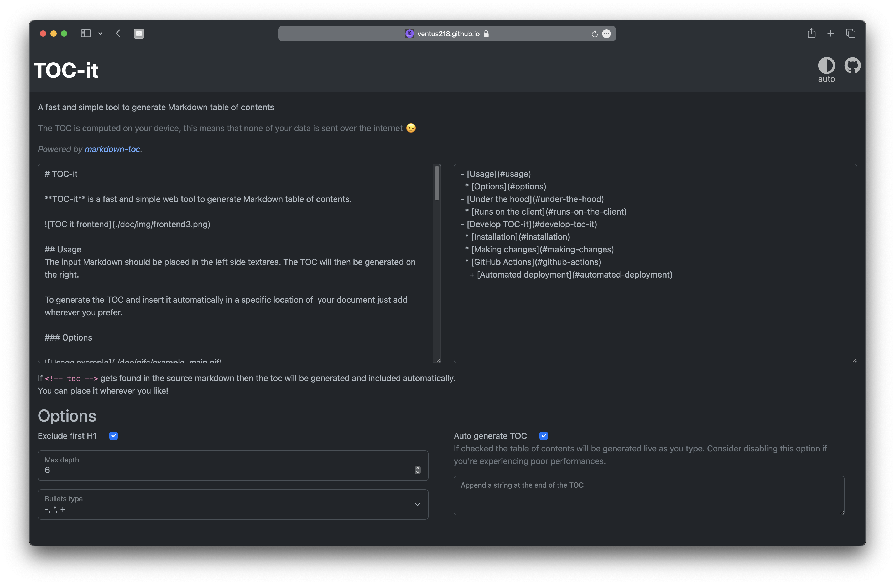

# TOC-it

**TOC-it** is a fast and simple web tool to generate Markdown table of contents.



<!-- toc -->

- [Usage](#usage)
  * [Options](#options)
- [Under the hood](#under-the-hood)
  * [Runs on the client](#runs-on-the-client)
- [Develop TOC-it](#develop-toc-it)
  * [Installation](#installation)
  * [Making changes](#making-changes)
  * [GitHub Actions](#github-actions)
    + [Automated deployment](#automated-deployment)

<!-- tocstop -->

## Usage
The input Markdown should be placed in the left side textarea. The TOC will then be generated on the right.

To generate the TOC and insert it automatically in a specific location of  your document just add `<!-- toc -->` wherever you prefer.

### Options


| Option | Description | Default |
|--------|-------------|---------|
| Exclude fisrt H1 | Allows to place the table of content before the first H1 while ignoring it (since usually it's just the page title) | Checked |
| Max depth | Ignore headings which nesting level is deeper than this value | 6 |
| Bullets type | Type of bullets to use in you TOC | -, *, + |
| Auto generate TOC | The TOC will be generated live as you type. Consider disabling this option if you're experiencing poor performances | Checked |
| Append string at the of the TOC | The content of this option will be concatenated to the end of the TOC | |

## Under the hood
TOC-it uses [markdown-toc](https://github.com/jonschlinkert/markdown-toc) to generate the table of contents.

### Runs on the client
TOC-it runs completely on the browser. This is made possible thanks to [browserify](https://browserify.org) which bundles up all the node dependencies of *markdown-toc* in a single JS file which is then shipped.

This allows not only to serve TOC-it through GitHub Pages (where websites must be static) but also improves privacy because the Markdown document never leaves the user's machine.

## Develop TOC-it

### Installation

1. Clone the repository
    ```sh
    git clone "https://github.com/Ventus218/TOC-it.git"
    cd TOC-it
    ```
1. Execute the setup script that will install the needed dependencies (node, browserify, uglifyjs)
    ```sh
    ./setup.sh
    ```
1. Run the build script which generates the bundled JS file and makes some optimizations
    ```sh
    ./build.sh
    ```
1. Now the website can be accessed on your local machine by just opening the *index.html* file.

    For simplicity you can just run 
    ```sh
    echo "file://$(pwd)/index.html"
    ```
    and open the output link in your preferred browser.

### Making changes
Now that everything is set up you can start making your changes.

Remember that every time you modify the *index.js* file (which contains markdown-toc and therefore needs to be bundled up by browserify) you must run again the `build.sh` script in order to apply them.

### GitHub Actions

#### Automated deployment
TOC-it is automatically deployed on every push to the main branch. (For more info look at [gh-pages.yaml](./.github/workflows/gh-pages.yaml))

You may notice that the bundled JS file is ignored in the [.gitignore](./.gitignore) file.
That's because the deployment action also automatically build the project, this allows to avoid errors made by humans which may push to the repo forgetting to build the project.
