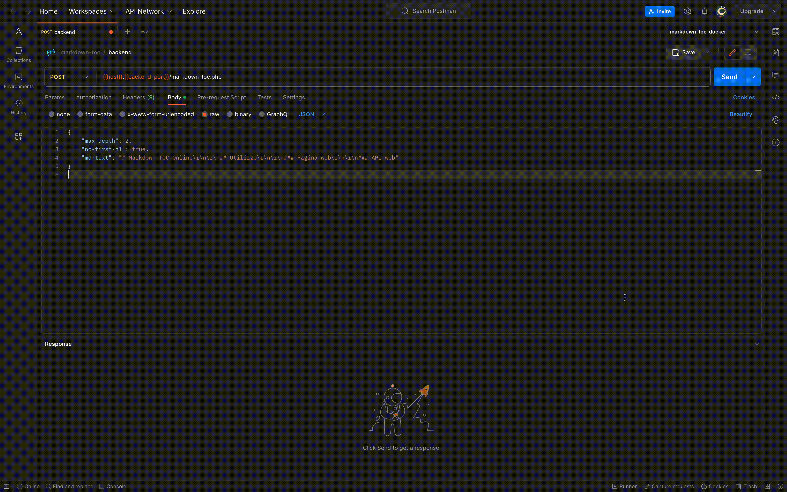

# Markdown TOC Online

Markdown TOC Online permette di generare la *table of contents* (l'indice) di un file scritto in Markdown.

E' possibile fruire del servizio sia attraverso una pagina web che attraverso una web API.

<!-- toc -->

- [Utilizzo](#utilizzo)
  * [Pagina web](#pagina-web)
  * [API web](#api-web)

<!-- tocstop -->

## Utilizzo

### Pagina web
Inserendo del testo in Markdown nella textarea di sinistra e cliccando il tasto *Generate* verrà generata sulla destra la table of contents (l'indice) del documento.

Sono anche disponibili diverse opzioni:
- Impostazione del livello di profondità da raggiungere.
- Esclusione del primo H1 (spesso non si vuole che la table of contents includa il titolo della pagina).
- Inserire automaticamente la table of contents all'interno del documento.

  Inserendo in qualsiasi parte del documento il commento `<!-- toc here -->` la table of contents verrà automaticamente inserita dove indicato.
  

### API web
Nel caso in cui si volesse automatizzare la generazione di table of contents è possibile utilizzare il servizio attraverso una semplice richiesta HTTP POST.

Il percorso verso il quale eseguire la chiamata è `/markdown-toc.php`

Il corpo della richiesta deve essere un oggetto JSON con i seguenti attributi:
|Attributo  |Tipo    |Opzionalità|Default|Descrizione|
|-----------|--------|-----------|-------|-----------|
|md-text    |Stringa |           |       |Il testo in Markdown del quale generare la table of contents|
|max-depth  |Intero  |Opzionale  |6      |Fino a che livello dei titoli considerare durante la generazione della table of contents|
|no-first-h1|Booleano|Opzionale  |false  |Il primo titolo H1 verrà escluso dalla table of contents|

La risposta è un oggetto JSON con i seguenti attributi:
|Attributo  |Tipo    |Opzionalità|Descrizione|
|-----------|--------|-----------|-----------|
|toc        |Stringa |Opzionale  |L'ouptut Markdown generato. (null in caso di errore)|
|error      |Stringa |Opzionale  |Descrizione dell'errore (null in caso di successo)|
|server-ip  |Stringa |           |L'indirizzo ip del server che ha generato la table of contents ([solo a scopo didattico](#testing-su-minikube))|
|max-depth  |Intero  |           |Indica con quale opzione è stata generata la table of contents|
|no-first-h1|Booleano|           |Indica con quale opzione è stata generata la table of contents|
